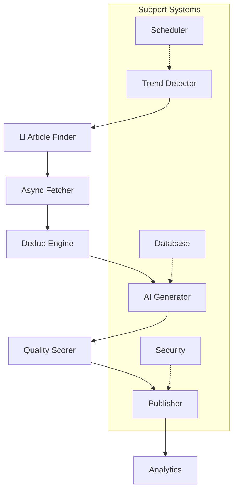

# ⚡ Zeitgeist — The World's First Fully-Automated AI Blogging Platform

> **Revolutionary end-to-end pipeline that discovers trends, generates content, and publishes articles autonomously**  
> Built as a proof-of-concept demonstrating complete automation from trend detection to live publishing with zero human intervention.

## ✨ What Makes Zeitgeist Special?

**Zeitgeist is the first fully-automated blogging application** that operates with complete autonomy:

🔍 **Intelligent Discovery** - Automatically detects trending topics from Google Trends, Reddit, and news sources  
📰 **Smart Aggregation** - Fetches and processes relevant articles with advanced deduplication  
🤖 **AI Generation** - Creates original, high-quality content using Ollama/Mistral with multiple fallback strategies  
📊 **Quality Assurance** - Comprehensive scoring system for readability, SEO, and engagement metrics  
🚀 **Multi-Platform Publishing** - Seamless publishing to HTML, Notion, and custom platforms  
📈 **Real-Time Analytics** - Advanced monitoring with health checks and performance metrics

## 🏗️ Architecture Overview



## 🚀 Quick Start

### Prerequisites

- **Python 3.8+**
- **Ollama** (for AI content generation)
- **Git**

### Installation

```bash
# Clone the repository
git clone https://github.com/yourusername/zeitgeist.git
cd zeitgeist

# Create virtual environment
python -m venv venv
source venv/bin/activate  # Windows: venv\Scripts\activate

# Install dependencies
pip install -r requirements.txt

# Install and setup Ollama
ollama pull mistral

# Configure environment
# Edit .env with your API keys (Reddit, Notion, etc.)

# Run single content cycle
python main.py --run-once
```

### Verify Installation

```bash
# Check system health
curl http://localhost:8000/health

# View system status
curl http://localhost:8000/status
```

## 🎯 Core Features

### **Trend Detection Engine**
- **Multi-source aggregation** from Google Trends, Reddit, RSS feeds
- **Intelligent deduplication** with similarity scoring
- **Fallback topics** for reliability

### **Content Generation Pipeline**
- **4-tier strategy system** (structured, detailed, standard, minimal)
- **Advanced prompt engineering** with validation
- **Quality scoring** across multiple dimensions
- **Automatic retry logic** with exponential backoff

### **Publishing System**
- **HTML generation** with customizable templates
- **Notion integration** with full property mapping
- **SEO optimization** with meta tags and structured data
- **Automated URL generation** and content organization

### **Monitoring & Analytics**
- **Real-time dashboard** with system metrics
- **Health monitoring** with automated alerts
- **Performance tracking** with detailed analytics
- **Structured logging** with rotation

## 📁 Project Structure

```
zeitgeist/
├── 📁 src/                          # Core application modules
│   ├── 📁 aggregator/               # Content fetching & deduplication
│   │   ├── article_fetcher.py       # Async web scraping engine
│   │   └── dedup_engine.py          # Content similarity detection
│   ├── 📁 generator/                # AI content generation
│   │   ├── generate_post.py         # Multi-strategy AI pipeline
│   │   └── quality_scorer.py        # Content quality analysis
│   ├── 📁 publisher/                # Multi-platform publishing
│   │   ├── post_to_site.py          # HTML & site generation
│   │   └── notion_publisher.py      # Notion API integration
│   ├── 📁 scheduler/                # Workflow automation
│   │   └── schedule.py              # APScheduler orchestration
│   ├── 📁 trends/                   # Trend detection & search
│   │   ├── detect.py                # Multi-source trend detection
│   │   └── search.py                # Article discovery engine
│   ├── 📁 database/                 # Data persistence
│   │   ├── models.py                # SQLite/PostgreSQL models
│   │   └── manager.py               # Database operations
│   ├── 📁 monitoring/               # System observability
│   │   ├── analytics.py             # Real-time analytics
│   │   ├── health_check.py          # Health monitoring
│   │   ├── metrics.py               # Performance metrics
│   │   └── alerts.py                # Alert management
│   └── 📁 maintenance/              # System utilities
│       ├── backup.py                # Automated backups
│       └── monitor.py               # CLI monitoring tools
├── 📁 templates/                    # HTML templates
├── 📁 docs/                         # Documentation
├── 📄 main.py                       # Application entry point
├── 📄 config.py                     # Configuration management
├── 📄 security_enhancements.py      # Security features
└── 📄 requirements.txt              # Dependencies
```

## ⚙️ Configuration

### Core Settings

```bash
# AI Configuration
AI_MODEL=mistral
AI_TIMEOUT=900
MIN_CONTENT_LENGTH=500

# Scheduling
SCHEDULING_INTERVAL=6        # Hours between cycles
MAX_POSTS_PER_DAY=8         # Safety limit

# Publishing
PUBLISHING_PLATFORMS=html,notion
AUTO_PUBLISH=true

# Security
SECRET_KEY=your-secret-key
SESSION_ SECRET=your-session-secret
```

### API Integration

```bash
# Required for full functionality
REDDIT_CLIENT_ID=your-reddit-id
REDDIT_CLIENT_ SECRET=your-reddit-secret
NOTION_TOKEN=your-notion-token
NOTIONDATABASE_ID=your-database-id
NEWSAPI_KEY=your-newsapi-key
```

## 🔧 Usage Examples

### Automated Operation

```bash
# Start full automation (runs continuously)
python main.py

# Monitor via web interface
open http://localhost:8000/health
```

### Manual Operation

```bash
# Generate single blog post
python main.py --run-once

# Check system status
python -c "from src.monitoring.health_check import health_monitor; print(health_monitor.perform_health_check())"
```

## 🛡️ Security Features

- **API Key Authentication** for admin endpoints
- **Rate Limiting** with automatic 429 handling
- **CSRF Protection** and XSS prevention
- **Content Security Policy** headers
- **Input Validation** and sanitization
- **Secure Session Management** with cleanup

## 📊 Monitoring & Health

### Built-in Endpoints

```bash
GET /health                 # System health check
GET /status                 # Configuration summary  
GET /api/admin/metrics     # Admin metrics (API key required)
POST /shutdown             # Graceful shutdown
```

### Performance Monitoring

- **Response time tracking** with sub-millisecond precision
- **Resource usage monitoring** (CPU, memory, disk)
- **AI service health checks** with automatic recovery
- **Database performance metrics** with optimization

## 🚀 Advanced Features

### Content Quality System

- **Readability Analysis** using Flesch-Kincaid scoring
- **SEO Optimization** with keyword density analysis
- **Engagement Metrics** including questions and CTAs
- **Technical Quality** assessment with recommendations

### Deduplication Engine

- **Content Fingerprinting** with SHA-256 hashing
- **Similarity Detection** using word shingles
- **Title Matching** with fuzzy comparison
- **Temporal Filtering** to prevent recent duplicates

## 🤝 Contributing

We welcome contributions! See our [Contributing Guide](contributing.md) for:

- **Development setup** and workflow
- **Code standards** and testing requirements  
- **Pull request process** and review guidelines
- **Issue reporting** templates and procedures

## 📝 License

This project is licensed under the **MIT License** - see the [LICENSE](LICENSE) file for details.

## 🙏 Acknowledgments

- **Ollama** for local AI model inference
- **Flask** ecosystem for web framework
- **APScheduler** for reliable task automation
- **aiohttp** for async HTTP operations
- **Beautiful Soup** for robust web scraping

## 📞 Support & Contact

- 🐛 **Issues**: [GitHub Issues](https://github.com/yourusername/zeitgeist/issues)
- 💬 **Discussions**: [GitHub Discussions](https://github.com/yourusername/zeitgeist/discussions)
- 📖 **Documentation**: [Architecture Guide](docs/architecture-guide.md)
- ⚙️ **Configuration**: [Configuration Guide](docs/configuration.md)

⭐ **If Zeitgeist helps automate your content creation, please star this repository!**

> **Zeitgeist represents the future of content automation - where AI doesn't just assist, but operates autonomously to create, curate, and publish high-quality content at scale.**
